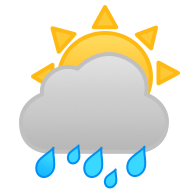
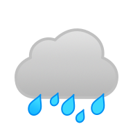

Deprecated
===========
This repo has been deprecated and replaced by [OpenWeatherImages](https://github.com/AnthonyArzola/OpenWeatherImages), a Swift Package. 

Local Weather Images
===========

Alternative weather condition images when working with OpenWeatherMap. See [OpenWeatherMap](https://openweathermap.org/weather-conditions "Weather Conditions") for complete list of weather conditions.

## Getting Started

All images have 192x192 resolution.

Images can be used in conjunction with [LocalWeatherKit](https://github.com/AnthonyArzola/LocalWeatherKit "LocalWeatherKit on GitHub"), an Objective-C library that simplifies communication with OpenWeatherMap API.

## Sample Images

## License
Creative Commons Attribution-NonCommercial 4.0 International (CC BY-NC 4.0)
